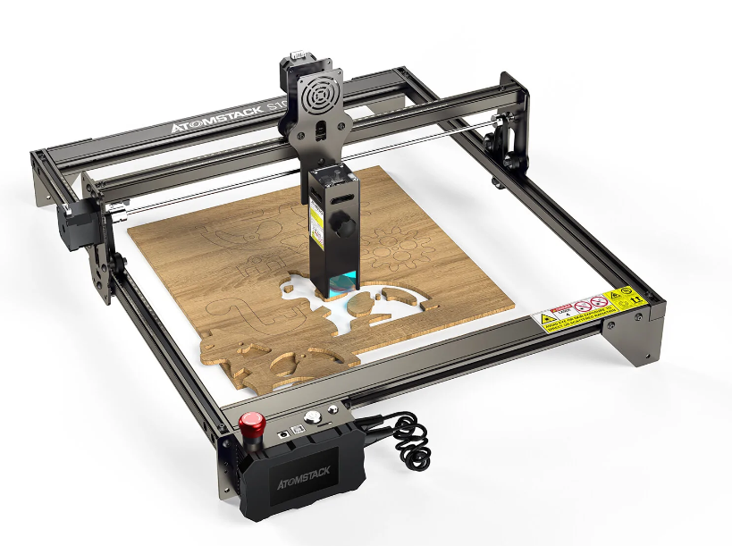

# Lasercutter

## Geplanter Verwendungzweck
- schneiden von nicht metallischen Werstoffen
  - Hauptsächlich Holz und Karton
- gravieren Werkstoffe aller Art

## Anforderungen
- Arbeitsraum ca. DIN A3 (29,7 x 42 cm) oder größer
- Schnitttiefe in Holz mind. 3 mm je Durchgang (Ingesammt mind. 10 mm bei mehreren Durchgängen)
- Offline Modus (soll auch ohne angeschlossenen Rechner Lasern können)
- Endschalter (wichtig für reproduzierbare Ergebnisse)

## Bisher gefundene Modelle
### [Atomstack S10](https://www.atomstack.net/collections/laser-engraver/products/atomstack-s10-pro-50w-laser-engraving-machine?variant=42821347606778) 

- Atomstack S10 wohl bis auf Farbe baugleich mit X7 und A10
- 40 x 41 cm Bauraum
  - Erweiterung auf 40 x 80 cm für 90 € möglich
- 10 W optische Laserleistung

#### Testberichte:
- [Techstage](https://www.techstage.de/test/atomstack-s10-pro-im-test-starker-laser-engraver-mit-10-watt-zum-schneiden-und/zpezs8m#nav-ring-42) 

#### Preis:
360 € [tomtop aus Lager on D](https://www.tomtop.com/de/p-os6227eu.html?_ga=2.149417270.1886502075.1668406549-2128827613.1620750406&_gac=1.61895774.1668406610.Cj0KCQiAyMKbBhD1ARIsANs7rEGIbOIaJtWY9oXyOlLVTQfMZN1alHnAqzkt551mTr96lshaxZPbbsMaAkf_EALw_wcB)
