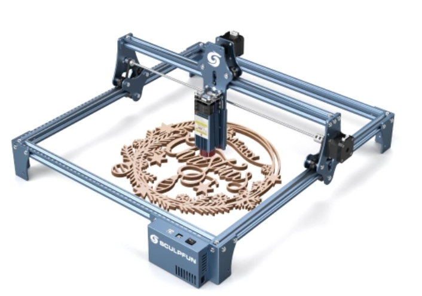

# Lasercutter

## Geplanter Verwendungzweck
- schneiden von nicht metallischen Werkstoffen
  - Hauptsächlich Holz und Karton
- gravieren Werkstoffe aller Art

## Anforderungen
- Arbeitsraum ca. DIN A3 (29,7 x 42 cm) oder größer
- Schnitttiefe in Holz mind. 3 mm je Durchgang (Ingesammt mind. 8 mm bei mehreren Durchgängen)
- Wünschenswert:
  - Offline Modus (soll auch ohne angeschlossenen Rechner Lasern können)

## Bauart
### Stand-Alone Gerät
Pros:
- kaufen und fast gleich nutzen können
- mobil, kann auch verliehen oder an anderem Ort genutzt werden

Cons:
- kleinerer Arbeitsraum (kann aber bei beiden gefundenen Modellen vergrößert werden, allerdings nicht auf die Größe bei der CNC)
- teurer
- weiteres Gerät

### Lasermodul an CNC-Frase anbauen
Pros: 
- Fräsen und lasern in einem Arbeitsgang (zumindest ohne Neuausrichtung des Werkstückes)
- CNC-Tisch wird sinnvoll genutzt
- größerer Arbeitsraum als bei Stand-Alone Gerät inkl. Erweiterungen
- ESTLCAM kann ohnehin schon Laser ansteuern
- etwas günstiger als Stand-Alone Gerät
- Kein zusätzliches Gerät das rumsteht
- keine neue SW zur Einarbeitung

Cons: 
- ortsfest im Keller (oder halt dort wo die CNC steht)
- in kleinem Umfang Anpassungen nötig zur Befestigung und zum Anschluss
- Preisunterschied Lasermodul zu Stand-Alone Gerät teilweise gering (sculpfun S9: nur Lasermodul  150 - 160 €, Komplettgerät 220 €)

## Bisher gefundene Stand-Alone Modelle
### #1 [Atomstack S10](https://www.atomstack.net/collections/laser-engraver/products/atomstack-s10-pro-50w-laser-engraving-machine?variant=42821347606778) 

- Atomstack S10 wohl bis auf Farbe baugleich mit X7 und A10
- 40 x 41 cm Bauraum
  - Erweiterung auf 40 x 80 cm für 90 € möglich
- 10 W optische Laserleistung
- kann auch ohne laufenden Rechner genutzt werden
- Endschalter (wichtig für reproduzierbare Ergebnisse)

#### Testberichte:
- [Techstage](https://www.techstage.de/test/atomstack-s10-pro-im-test-starker-laser-engraver-mit-10-watt-zum-schneiden-und/zpezs8m#nav-ring-42) 

#### Preis:
ca. 450 € [tomtop aus Lager on D](https://www.tomtop.com/de/p-os6227eu.html?_ga=2.149417270.1886502075.1668406549-2128827613.1620750406&_gac=1.61895774.1668406610.Cj0KCQiAyMKbBhD1ARIsANs7rEGIbOIaJtWY9oXyOlLVTQfMZN1alHnAqzkt551mTr96lshaxZPbbsMaAkf_EALw_wcB)

### #2 [Sculpfun S9](https://www.atomstack.net/collections/laser-engraver/products/atomstack-s10-pro-50w-laser-engraving-machine?variant=42821347606778) 

- 41 x 42 cm Bauraum
  - Erweiterung auf 41 x 95 cm für 75 € möglich
- 5,5 W optische Laserleistung (aber scheinbar sehr gute Schnittleistung in Holz)

#### Testberichte:
- [3d-grenzenlos](https://www.3d-grenzenlos.de/test/lasergravierer/sculpfun-s9/) 
- [techstage](https://www.techstage.de/test/desktop-laser-sculpfun-s9-im-test-graviert-und-schneidet-holz-bis-10-mm/xdh8dlg)

#### Preis:
213 € [tomtop Blitzangebot aus Lager in D]([https://www.tomtop.com/de/p-os6227eu.html?_ga=2.149417270.1886502075.1668406549-2128827613.1620750406&_gac=1.61895774.1668406610.Cj0KCQiAyMKbBhD1ARIsANs7rEGIbOIaJtWY9oXyOlLVTQfMZN1alHnAqzkt551mTr96lshaxZPbbsMaAkf_EALw_wcB](https://www.tomtop.com/de/p-rtoxy-s9-eu.html))

## Kauf alleine oder mit anderen
### #1 Kauf alleine
Pros:
- keine Absprache nötig 
- Gerät immer verfügbar
- kann an CNC angebaut werden 

Cons:
- teurer
- Raffael muss alles alleine herausfinden (z.B. beste Schnittparameter für verschiedene Werkstoffe oder Nutzung der Software)
- Gerät steht meist nur rum und wird wenig genutzt

### #2 Gruppenanschaffung
Tausche Pros und Cons von #1

## Fazit
Ursprünglich war geplant den Atomstack S10 zu kaufen. Mittlerweile tendiere ich eher dazu den günstigeren Sculpfun S9 zu kaufen (und dessen Lasermodul ggf. auch an der Fräse nutzen zu können).
Aufgrund des günstigen Preises ist ein Gruppenkauf nicht mehr ganz so notwendig. Durch die nun stark begrenzte "Bastelzeit" sind Vorteile eines Einzelkaufes durch die dadurch ständige Verfügbarkeit des Gerätes gegeben.

Daher: Erstmal den günstigen Preis nutzen und zuschalgen. Ob sich andere später daran beteiligen möchten ist erstmal egal. Ziel sollte halt sein dass der Laser primär in der Werkstatt steht und verfügbar ist wenn ich ihn brauche.

